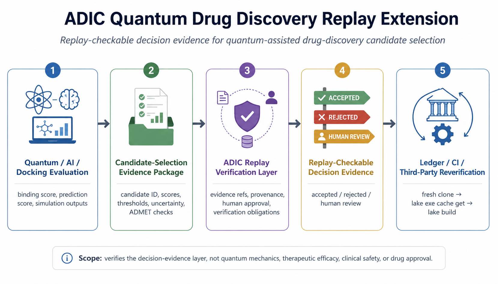

# ADIC Quantum Drug Discovery Replay Extension

[](https://github.com/GhostDriftTheory/adic-lean-qdd-replay/actions/workflows/ci.yml)

This repository contains a reproducible Lean 4 artifact for an ADIC domain extension in quantum-assisted drug-discovery candidate selection.

It extends the ADIC replay-verification architecture to candidate-selection evidence in a quantum drug discovery setting.

The artifact shows how candidate identifiers, scores, thresholds, uncertainty, ADMET-related checks, provenance, evidence references, human approval records, and verification obligations can be represented as replay-checkable decision evidence.

This repository does not formalize quantum mechanics, molecular biology, therapeutic efficacy, clinical safety, or drug approval.

## Overview



## Relationship to the ADIC core artifact

This repository is derived from the ADIC replay-verification core artifact:

```text
https://github.com/GhostDriftTheory/adic-lean-proof-replay
```

The original core artifact establishes the replay-verifier soundness structure for ADIC.

This repository keeps that core and adds a quantum drug discovery domain layer.

## Main Lean files

```text
ADIC_RSound_Replay.lean              ADIC replay-verification core
ADIC_QuantumDrugDiscovery.lean       Quantum drug-discovery domain extension
```

## What this artifact establishes

This artifact establishes a replay-checkable structure for quantum-assisted drug-discovery candidate-selection evidence.

At a high level, it shows that candidate-selection decisions can be organized into ADIC-style packages containing:

```text
candidate identifiers
evaluation values
thresholds
uncertainty information
constraint checks
ADMET-related checks
evidence references
provenance references
human approval records
verification obligations
```

The intended verification target is not whether a molecule is therapeutically effective.

The target is whether the recorded candidate-selection decision satisfies the replay-checkable obligations associated with the decision package.


## Verification target

The Lean artifact verifies the replay-checkable structure of candidate-selection evidence.

The verification target is not the scientific validity of the molecular candidate itself, but the consistency of the recorded decision package with the obligations required for replay verification.

In this sense, the artifact provides an accountability layer for quantum-assisted drug-discovery workflows: it checks whether the recorded decision evidence can be replayed and verified after the fact.

## Scope

This repository covers the Lean-side structure for replay-verifiable candidate-selection evidence.

It does not cover:

```text
Quantum-mechanical correctness
Molecular simulation correctness
Docking-model correctness
Therapeutic efficacy
Clinical safety
Regulatory approval
Production-system correctness
```

The goal is to provide a mechanically checked domain-layer extension showing how ADIC replay verification can be applied to quantum-assisted drug-discovery candidate selection.

## Reproducibility

This repository is a reproducible Lean/Lake artifact.

The Lean version is fixed by `lean-toolchain`, and Mathlib is pinned through `lake-manifest.json`.

A fresh clone should verify with:

```bash
git clone https://github.com/GhostDriftTheory/adic-lean-qdd-replay.git
cd adic-lean-qdd-replay
lake exe cache get
lake build
```

Successful verification means that `lake build` completes without errors.

## Repository structure

```text
ADIC_RSound_Replay.lean              ADIC replay-verification core
ADIC_QuantumDrugDiscovery.lean       Quantum drug-discovery domain extension
lean-toolchain                       Lean toolchain pin
lakefile.lean                        Lake project file
lake-manifest.json                   Lake dependency lock file generated by `lake update`
.github/workflows/ci.yml             GitHub Actions verification workflow
README.md                            Repository description
```

## Verification evidence

The primary verification evidence is:

```text
fresh clone -> lake exe cache get -> lake build
```

The GitHub Actions workflow runs the same Lean/Lake verification on every push and pull request.

Screenshots may be kept as supplementary evidence, but they are not the reproducibility mechanism.

## Public positioning

This repository should be cited as:

```text
ADIC Quantum Drug Discovery Replay Extension
```

Recommended one-line description:

```text
A Lean 4 domain-layer artifact showing how ADIC replay verification can be extended to quantum-assisted drug-discovery candidate selection.
```
